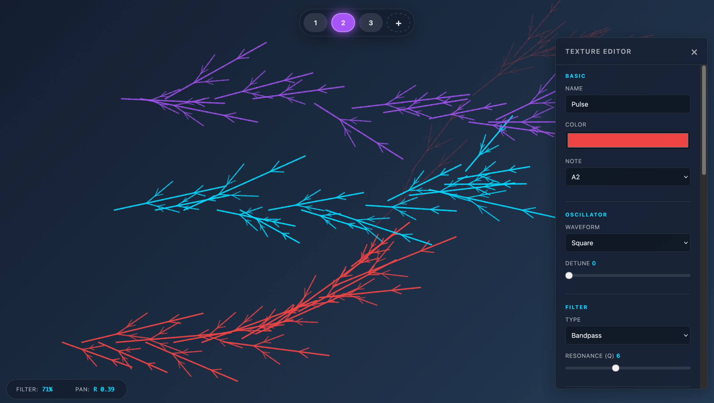

# 🎵 DrawDron

**Instrumento Generativo de Drones** — Dibujá en el canvas para crear música drone evolutiva con visuales fractales L-System.

Construido con [Paper.js](http://paperjs.org/) + [Tone.js](https://tonejs.github.io/) — 100% Open Source.



---

## 🚀 Instalación y Ejecución

### Opción 1: Inicio rápido (sin instalación)
```bash
# Clonar el repositorio
git clone https://github.com/vlasvlasvlas/drawdron.git
cd drawdron

# Servir con cualquier servidor estático
npx serve .

# Abrir http://localhost:3000
```

### Opción 2: Python Server
```bash
cd drawdron
python3 -m http.server 8000
# Abrir http://localhost:8000
```

### Opción 3: Abrir directo
Abrí `index.html` en tu navegador (Chrome/Firefox recomendado).

> ⚠️ **Nota**: El audio requiere interacción del usuario para iniciar. Hacé click en el canvas primero.

---

## 🎮 Controles

| Acción | Control |
|--------|---------|
| **Dibujar** | Click & arrastrar en el canvas |
| **Cambiar textura** | Teclas `1` `2` `3` o click en botones |
| **Editar textura** | Doble-click en botón de textura |
| **Agregar textura** | Click en botón `+` |
| **Limpiar canvas** | Tecla `C` |

---

## 🎛️ Mapeo de Parámetros

| Posición | Parámetro de Audio |
|----------|-------------------|
| **Eje X** | Pan Estéreo (Izquierda ↔ Derecha) |
| **Eje Y** | Corte del Filtro (Oscuro ↔ Brillante) |
| **Fade visual** | Fade de audio (sincronizado) |

---

## 🎨 Texturas por Defecto

| # | Nombre | Color | Carácter | Nota |
|:-:|--------|-------|----------|------|
| 1 | Deep Hum | 🔵 Cyan | Drone grave | C2 |
| 2 | Shimmer | 🟣 Púrpura | Ambient etéreo | E4 |
| 3 | Pulse | 🔴 Rojo | Industrial rítmico | A2 |

---

## 🔧 Personalización

Las texturas son JSON completamente configurables. Ver **[SOUNDS.md](./SOUNDS.md)** para documentación completa de creación de sonidos.

### Export/Import rápido
1. Doble-click en cualquier botón de textura
2. Click **Export JSON** para guardar
3. Editá el archivo JSON
4. Click **Import JSON** para cargar

---

## 📁 Estructura del Proyecto

```
drawdron/
├── index.html              # Punto de entrada
├── css/
│   └── style.css           # Tema glassmorphism oscuro
├── js/
│   ├── main.js             # Inicialización
│   ├── canvas.js           # Paper.js drawing & L-System
│   ├── audio.js            # Motor de síntesis Tone.js
│   ├── lsystem.js          # Generador de fractales L-System
│   ├── textures.js         # Gestión de texturas
│   └── ui.js               # Controles de UI & editor
├── data/
│   └── textures.json       # Presets por defecto
├── README.md               # Este archivo
└── SOUNDS.md               # Guía de creación de sonidos
```

---

## 🛠️ Stack Tecnológico

| Librería | Versión | Propósito |
|----------|---------|-----------|
| [Paper.js](http://paperjs.org/) | 0.12.17 | Gráficos vectoriales & canvas |
| [Tone.js](https://tonejs.github.io/) | 14.8.49 | Síntesis de audio Web |

Sin build tools. Vanilla JS puro.

---

## 📝 Licencia

MIT License — Usá libremente, modificá, distribuí.

---

## 🙏 Créditos

Inspirado en [L-Drones](https://codepen.io/teropa/pen/opjrBE) de Tero Parviainen.
